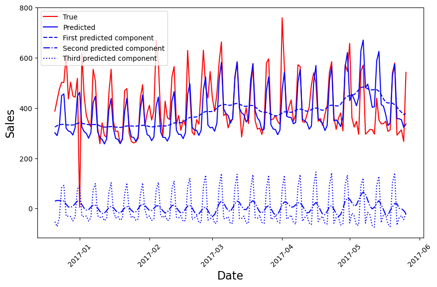

# N-HiTS

This repository contains an implementation of the **N-HiTS** architecture, first presented in [N-HiTS: Neural Hierarchical Interpolation for Time Series Forecasting](https://arxiv.org/pdf/2201.12886).

The dataset used for this example can be found at [Store Sales - Time Series Forecasting](https://www.kaggle.com/competitions/store-sales-time-series-forecasting/). In particular, a model is defined and trained for each category present in the dataset.

The code is organized in the following sections:

- [Preprocessing](./docs/doc_preprocess.md): this section prepares data for the model;
- [Strategy filtering](./docs/doc_model.md): this section defines and trains the model.

The phases of preprocessing and training can be controlled by the configuration file in the root directory, whose parameters are described in [Configuration](./docs/doc_config.md).

After training with the parameters given in the configuration file, a typical prediction of the model is like the following one:

